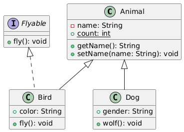

# 迭代一：JClassDiagram的设计与实现

## 截止时间

**2025 年 3 月 31  日 23：59**

## 实验描述

在《软件工程与计算II》以及往年的《软件系统设计》课程中，类图绘制是贯穿课程实践的重要环节。尽管IntelliJ IDEA等工具已具备成熟的类图自动生成功能，但我们能否基于所学知识，尝试自行实现一个类图生成工具呢？

因此，在本门课程的实验作业中，你需要设计并用Java代码实现一个 **为Java代码自动生成类图** 的工具，我们将其命名为 JClassDiagram。JClassDiagram可以读取指定的Java文件，经过分析处理后，在控制台输出类图的 PlantUML 文本形式。

!!! tip "开始你的实验"
    
    使用GitHub的fork功能将实验框架代码复制到你们小组的仓库中，并使用 `git clone https://github.com/your-repo/nju-ssd-2025-design-pattern-lab.git` 将实验框架代码下载到本地。


目前，已有非常多成熟的工具来根据指定语言绘制UML类图，例如 [在线UML编辑器](https://sujoyu.github.io/plantuml-previewer/)。因此，在本次实验中，你只需要完成从Java代码生成PlantUML语法的文本格式类图即可。

??? note "Q：PlantUML是什么？"
    （DeepSeek-R1）PlantUML 是一款开源的文本化图表生成工具，允许用户通过简单的领域特定语言（DSL）快速创建多种类型的图表。它通过将文本代码转换为可视化图表，简化了图表设计的过程，尤其适合需要频繁更新或与代码库协同工作的场景。

    PlantUML基于 Java，你可在任何支持 Java 的环境中运行PlantUML。你可以从[官网](https://plantuml.com/zh/)直接下载 jar 文件执行，也可以使用 IDEA 或 VSCode 的插件，方便你将 PlantUML 集成到你的工作流中。

    你可以阅读 [PlantUML官方文档](https://plantuml.com/zh/) 来学习它的语法，当然，直接询问大语言模型（如[DeepSeek-R1](https://chat.deepseek.com/)）可能是更简单的选择。实验文档中只对PlantUML做简单的介绍。


这是一个PlantUML语法类图的示例，包含了Java中的**类**、**接口**以及**继承关系**和**实现关系**，在迭代一中，你的目标就是生成这样的玩意儿：

```java linenums="1"
@startuml
class Animal {
    - name: String
    + {static} count: int
    + getName(): String
    + setName(name: String): void       
}
class Bird {
    + color: String
    + fly(): void
}

class Dog {
    + gender: String
    + wolf(): void
}
interface Flyable {
    + fly(): void
}
Animal <|-- Dog
Animal <|-- Bird
Flyable <|.. Bird
@enduml
```

其对应的类图如下：



> 你可以在[在线UML编辑器](https://sujoyu.github.io/plantuml-previewer/)中快速运行这个示例。

PlantUML语法以`@startuml`开头并以`@enduml`结尾，中间是类图的具体内容。注意在实现的过程中不要遗漏这两个关键字。

## Part 1： 提取类和接口的信息

很显然，我们需要解析Java代码来获取类和接口的信息。幸运的是，你不再需要像《编译原理》课那样手写`g4`文件并交`ANTLR4`来进行词法分析和语法分析。

你需要使用JavaParser库来解析Java文件，并提取其中的类和接口的信息。我们不会在实验文档中详细介绍JavaParser的使用方法 *（它很简单而且去年也没介绍）*，你可以查阅手册或询问大语言模型来了解它的用法。我们会列出你必须关注的信息：

### 1.1 提取类的信息（不含抽象类）

- 类名
- 属性（包括访问修饰符、是否是静态成员、成员类型、名称）
    - PlantUML格式：`<访问修饰符> <static> 属性名: 属性类型`
    - 示例：`- name: String`
    - 在迭代一中，所有属性均为`String/int/double`类型，不需要输出继承自父类的属性。
  
- 方法（包括访问修饰符、是否是静态方法、返回类型、名称、参数）
    - PlantUML格式：`<访问修饰符> <static> 方法名 (参数名1: 参数类型1, 参数名2: 参数类型2, ...) : 返回类型`
    - 示例：`+ {static} calculate(a: int, b: int): int`
    - 对于继承自父类的方法，如果没有重写（override）不需要重复输出；构造函数不需要输出。

访问修饰符的符号和关键字的对应关系如下表：

| PlantUML符号 | 访问修饰符 |
| ---- | ---------- |
| -    | private    |
| #    | protected  |
| ~    | package private    |
| +    | public     |

### 1.2 提取接口的信息

- 接口名
- 方法（返回类型、名称、参数）
    - PlantUML格式：`<访问修饰符> <static> 方法名 (参数名1: 参数类型1, 参数名2: 参数类型2, ...) : 返回类型`

!!! tip "Java9 及之后"
    Java 9 引入了接口的私有方法（private 方法），允许在接口内部定义辅助方法，避免代码重复。为了简化代码实现，我们仍按照Java 8及之前的规定，及默认接口没有私有方法。此外，我们默认测试用例中接口里不会出现字段。
    
    根据Java语言规范，接口中所有方法的访问权限默认是public。注意在这个例子中：
    ```java
    interface Flyable {
        void fly();       
    }
    ```
    `fly()` 方法的访问修饰符应当是`public`。

!!! warning "注意输出格式要求"
    为了通过测试，**请严格按照格式输出，注意空格的数量**。

## Part 2： 分析继承关系和实现关系

你需要分析类和接口之间的继承关系和实现关系，并生成对应的PlantUML文本。我们会列出你必须关注的点：

### 2.1 分析继承关系

- 类继承自哪个类
- 接口继承自哪些接口

在类图中，继承关系用带空心箭头的实线表示，箭头指向父类。PlantUML文本格式如下，注意不要遗漏或多出空格：

```
Parent <|-- Child
```

### 2.2 分析实现关系

- 类实现了哪些接口

在类图中，实现接口关系用带空心箭头的虚线表示，箭头指向接口。PlantUML文本格式如下，注意不要遗漏或多出空格：

```
Interface <|.. Implementation
```

在本次实验中，你无需分析类之间的依赖、关联、聚合和组合关系。


## Part 3： 生成整体类图的PlantUML语法文本

你需要将上述信息转换为PlantUML语法，并生成对应的类图。为了方便测试，我们要求你按照以下要求生成类图：

- 对于一个类，你需要按照属性、方法的顺序给出。对于属性和方法，你需要按照访问修饰符private、protected、package private、public的顺序给出。属性和方法缩进四个空格，一个类的PlantUML文本中不要有多余的换行。
- 对于整个类图，你需要按照类、接口、继承关系、实现关系的顺序给出。
- 类图中的描述类、接口、继承关系、实现关系的PlantUML文本间空行不做要求，没做要求的按任意顺序输出。

## 代码与测试

项目使用 JDK17 和 Maven 构建，你可以在IDEA或VSCode中打开项目，并使用Maven插件运行测试用例。为了便于测试，我们建议所有的项目Java代码都放在 `src/main/java` 目录下。

作为软件设计课程，你们小组可以尽情发挥自己想法的来组织软件，因此你会发现框架代码中几乎什么都没有（逃）。为了便于测试，我们要求你严格按照以下要求提供测试接口：

你需要实现 `ClassDiagramGenerator` 类，它包含一个 `parse` 方法，用于解析指定路径下的Java文件，并返回一个 `ClassDiagram` 对象。`ClassDiagram` 对象包含一个 `generateUML() : String` 方法，用于生成PlantUML语法的文本格式类图。

**使用示例：**

```java linenums="1"
// 创建ClassDiagramGenerator对象
ClassDiagramGenerator generator = new ClassDiagramGenerator();
// 解析指定路径下的Animal.java文件，生成ClassDiagram对象
ClassDiagram diagram = generator.parse(Paths.get(path));
// 输出生成的UML图
System.out.println(diagram.generateUML());
```

我们提供了一些测试用例，保存在 `src/test/java` 目录下，你可以直接运行测试用例来检查你的实现是否正确。

## 提交与评分

!!! note "全新的评测方式"
    我们希望把事情做得更好，因此今年我们新采用了 [GradeScope](https://www.gradescope.com/) 平台来进行评分。后台采用 Ubuntu22.04 + JDK17 对大家的代码进行测试。
    
    你可以在 [团队填报与OJ使用方法](/lab1/oj/) 页面查看具体的指南。


你需要提交 **项目代码** 和 **软件设计文档** 。

为了避免不必要的内卷，我们在框架代码中为你准备了设计文档模板（markdown格式）。你也可以从[这里](https://git.nju.edu.cn/Nboxff/software_design_framework_2025/-/raw/main/docs/iter1_template.md?ref_type=heads&inline=false)下载。

**在 GradeScope 上提交项目代码：**

1. **注册账号**：请每位同学按照 [团队填报与OJ使用方法](/lab1/oj/) 中的指南注册账号。
2. **组队**：在每次作业提交后，根据 GradeScope 的提示完成组队。
3. **代码要求**：
      - 代码必须位于 `src/main/java/` 目录下。
      - 提交ZIP文件（不要提交.class文件，也不要提交测试文件），参考 `lab0` 的提交格式。
      - 我们在框架代码中增加了 `package.sh` (Linux) 和 `package.py` (跨平台) 的打包脚本，方便大家自动化打包。
4. **提交**：任一成员提交后，所有组员将看到分数。
5. **查看反馈**：提交后30分钟内查看自动评分结果。
  
软件设计文档提交到教学立方的作业中。

## 其他要求与提示

### 使用Git管理小组软件项目

1. 你需要使用git来管理你小组的代码，请在开发的过程中遵守git的提交规范，我们会通过git提交记录跟踪你们的设计过程，并且将每次迭代的最终版本的git提交信息设置为`iter{n}_finish`（如第⼀次迭代为`iter1_finish`）。
2. 除迭代一外，每⼀次迭代需要在上⼀次迭代的最终版上继续更改，在三次迭代结束后我们会检查完整的三次迭代的git提交信息.
3. 除了本地的git追踪外，你还需要在 [git.nju.edu.cn](https://git.nju.edu.cn/) 上创建git仓库进行远程的备份，仓库命名为`software_design_小组号`，**并将仓库设置为private**，在项目三次迭代结束后，我们会收集所有同学的项目链接，并对你的项目实现与文档进行检查。
4. 为了控制提交大小，**请务必通过 `.gitignore`文件来过滤build、target等产物目录**。

### 团队协作

- 请务必遵循团队协作规范，确保代码质量，**不要做团队杀手**！😡。
- 建议在每位同学阅读完文档后再在小组内进行讨论，确定软件设计并分工进行开发。

### 软件设计

!!! tip "弹性系统设计"

    考虑到项目未来的迭代，请从复用性和维护性的角度出发，设计一个弹性的系统，以便应对未来的变更。

1. 小组应该合理把握类的设计，在保证软件可扩展性、可维护性、符合设计原则的同时避免过度设计。
2. 在下一次迭代中，你仍然可以修改你们小组的设计并重构代码，但需要保证修改后的设计仍然符合本次迭代的要求。 *（学了新的设计模式，可能会对设计有新的理解）*
3. 软件系统设计无标准答案🎈。
   
!!! danger "实验警告"
    - 学生不得复制其他小组的代码和设计文档
    - 学生不得向其他小组提供代码和设计文档