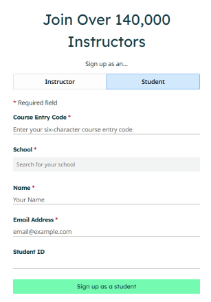
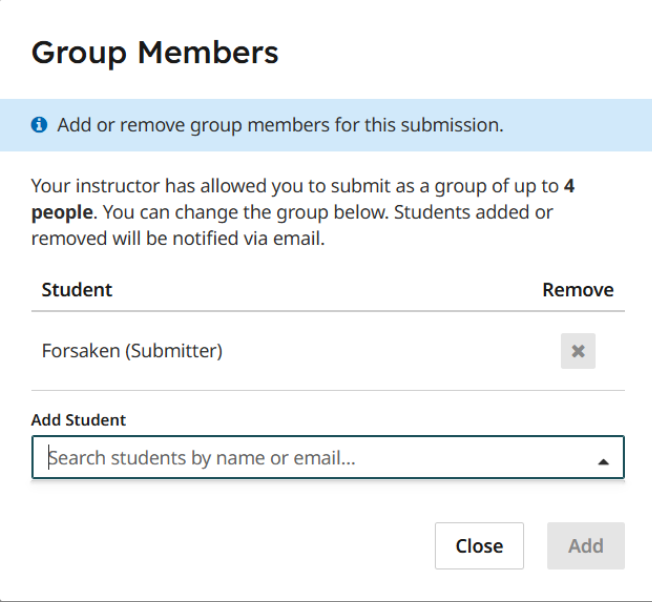
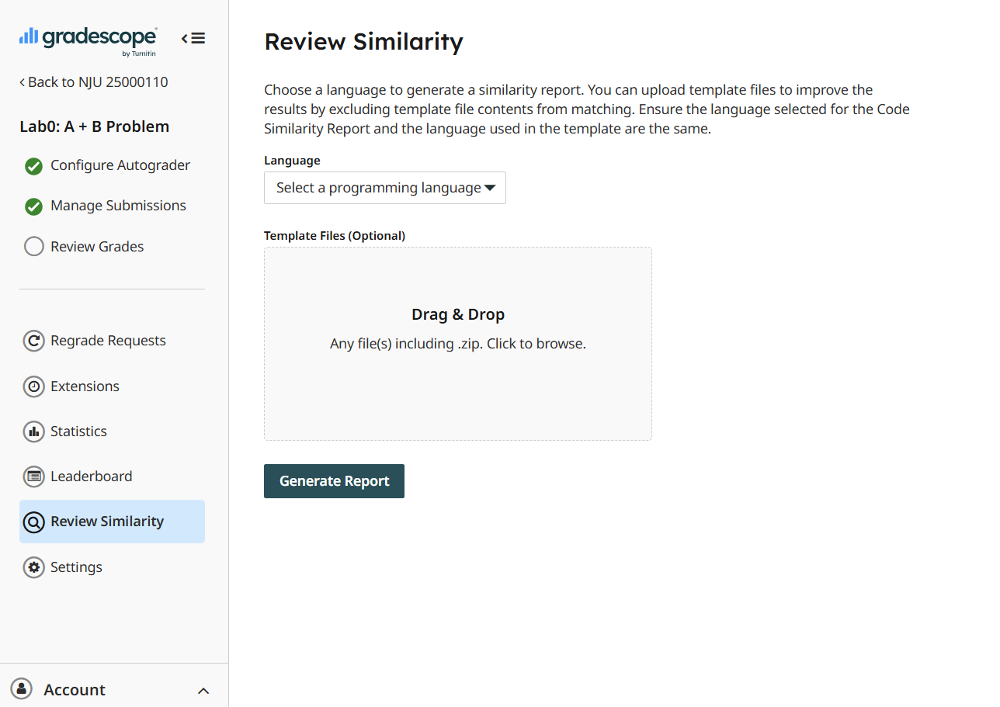

# 团队填报与OJ使用方法

# 团队填报

访问 [组队填报]() (已关闭) 进行组队，系统会为你自动分配小组号，该小组号用于确定你的仓库名，请记得及时保存。

如果你是一个命令行爱好者，也可以使用以下命令进行组队：

```bash
curl -X POST -H "Content-Type: application/json" -d '{"members":[{"name":"张三","id":"2021001"},{"name":"李四","id":"2021002"}]}' http://组队系统已关闭:5000/api/groups
```

!!! warning "更改组队"
    若要更改组队，请联系 谢博帆 助教进行修改，开始实验后不得更改队伍。

## 注册 GradeScope

!!! tip "为什么使用GradeScope"
    （DeepSeek-V3）GradeScope 是一个在线评分和评估平台，主要用于教育领域，帮助教师高效批改作业、考试和项目。
    
    **优点：**

    - 自动化测试项目代码正确性，可以自定义检查规则（例如CodeStyle检查）
    - 提供代码相似性检查
    - 提供排行榜，方便大家查看自己的进度
    - 支持团队提交
    - 未来有机会支持同学任意选择C++或Java语言完成实验（画大饼）

> **注意**：本课程的 GradeScope Online Judge 不再接受新的注册和提交！ 

1. 访问 [GradeScope](https://www.gradescope.com/)，点击右上角的 `Sign Up`。选择Sign up as an..., 然后选择 `Student`，并点击 `Continue`。

    

2. Course Entry Code填写 **`XXXXXX`**，School 选择 `Nanjing University`。Name 请填写真实姓名，Student ID请填写南大校内学号。

3. 完成注册后登录，你可以看到你已经完成选课 NJU 25000110 (Spring 2025) 软件系统设计，请开始你的实验吧。

## 提交代码

我们准备了 **lab0: A + B Problem** 帮助大家熟悉 GradeScope 的提交。

你需要准备一个项目并将其打包成.zip压缩包，结构如下：

```
project.zip
|-- src
    |-- main
        |-- java
            |-- Calaculator.java
```

在`Calaculator.java`中实现以下代码：
```java
class Calculator {
    // 定义一个方法，用于计算两个整数的和
    public int add(int a, int b) {
        // 返回两个整数的和
        return a + b;
    }
}
```

然后，在GradeScope中进行提交。选择`Upload`, 填写你在排行榜上的名字（Leaderboard Name），最后点击`Upload`按钮。

由于评测时需要构建容器，安装所需的依赖，请耐心等待系统完成评测。

## 在GradeScope中组建队伍

每次提交都需要在GradeScope中组建队伍，请按照以下步骤操作：

1. 提交完代码后，点击页面最下方的`Group Members`按钮。

2. 根据系统提示添加小组成员。 

    

3. 注意你的小组成员必须和你在组队填报中填写的信息、设计文档中的信息保持一致。

## 代码相似性检查

GradeScope 为老师和助教提供了代码相似性检查的功能，请不要拷贝其他小组的代码实现。

