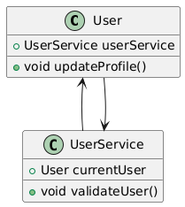
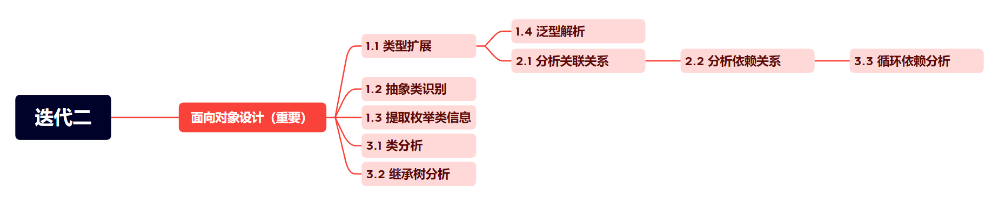

# 迭代二：更多类图元素与基于类图的分析器

!!! tip "开始之前"

    在迭代二中，我们设计了可以“并行”进行的编程任务。注意迭代二任务量较大，请各小组尽早明确分工并合理规划时间。


## 截止时间

**2025 年 4 月 15 日 23：59**

## 实验描述

在迭代一中，我们已经实现了类、接口、继承关系、实现关系的解析，并生成了对应的PlantUML文本格式类图。在迭代二中，我们将进一步解析更多类图中的元素和关系，使 JClassDiagram 能够生成较完整的类图。除此之外，我们还希望你能实现几个基于类图的程序分析器，帮助程序员发现代码中的“坏味道”。

!!! tips "获取测试用例"
    我们在 [GitHub 仓库](https://github.com/Nboxff/nju-ssd-2025-design-pattern-lab) 中添加了迭代二的测试用例，请将仓库的测试部分添加到你们小组的实验仓库中。

## Part 1: 更多类图元素的解析

在迭代一中我们已经完成了基础类/接口的解析，在迭代二的Part 1中，我们需要扩展对复杂Java元素的支持。

特别提醒的是，如果你觉得 1.1 和 1.2 的任务量特别大，我们建议你认真评估迭代一的设计。

### 1.1 类型扩展

首先，让我们扩展属性的类型，在迭代二中你需要扩展考虑以下类型：

- 布尔类型（boolean）、基本类型的封装类（如`Integer`等）、自定义类/接口
    - 测试用例中会出现的类型：`int`、`Integer`、`double`、`Double`、`float`、`Float`、`long`、`Long`、`short`、`Short`、`byte`、`Byte`、`boolean`、`Boolean`、`char`、`Character`、`String`
- 数组类型（注意要保留所有维度标记，即`[]` → `[]`，`[][]` → `[][]`）
- 复杂容器类型，如：`List<T>`、`Set<T>`、`Map<K, V>` 等（注意保留泛型参数，你需要考虑嵌套容器如 `List<List<Integer>>`）

参考样例:

```java
public class A {
    private int[] a;
    protected Map<String, List<Integer>> c;
    public boolean d;
}
```

对应的PlantUML文本为 (省略 `@startuml` 和 `@enduml` 标签，该样例结果唯一)：

```java
class A {
    - a: int[]
    # c: Map<String, List<Integer>>
    + d: boolean
}
```

!!! tips "编程提示"
    如果你在迭代一中有良好的实现，你可以不作任何修改地实现布尔类型（boolean）、基本类型的封装类、容器等类型的支持。

    了解 Javaparser 中 `VariableDeclarator`类的 `getType()`方法和 `Type` 中的 `toString()`方法，会大大简化你的实现。

### 1.2 抽象类识别

- 类声明含 `abstract` 时添加 `abstract` 前缀，标记该类为抽象类
- 抽象方法需标记 `{abstract}` 符号

此时，方法的PlantUML文本格式更新为：
```java
<访问修饰符> <static> <abstract> 方法名 (参数名1: 参数类型1, 参数名2: 参数类型2, ...) : 返回类型
```

### 1.3 提取枚举类的信息

- 枚举名：完整名称
- 枚举常量：所有显式定义的常量值（如 RED, GREEN）
- 属性：
    - 访问修饰符（默认 private，遵循Java枚举规范）
    - 是否静态成员（static 关键字）
    - 成员名称
    - 成员类型（需支持基础类型及自定义类型）
- 方法（不需要输出枚举的构造函数）：
    - 访问修饰符（遵循Java规范，默认 public）
    - 是否静态方法（static 关键字）
    - 返回类型（含 void）
    - 方法名称
    - 参数列表（参数名和类型，需保留泛型信息，见泛型部分）

你需要按照枚举常量、属性、方法的顺序进行输出，其他细节顺序与类、接口的输出保持一致。枚举常量的输出顺序不作要求。

同类和接口一样，枚举常量、属性和方法需要缩进四个空格。如果枚举中没有显示定义枚举常量的值，则不需要输出括号。

PlantUML文本示例 (省略 `@startuml` 和 `@enduml` 标签，该样例结果不唯一)：
```java
enum LogLevel {
    ERROR(4)  
    WARN(3)  
    INFO(2)  
    - severity: int  
    + {static} fromSeverity(sev: int): LogLevel  
    + getSeverity(): int  
}

enum LogLevelWithoutValue {
    ERROR  
    WARN  
    INFO  
}
```

### 1.4 泛型解析

为了使 JClassDiagram 能在真正的 Java 项目中使用，我们需要支持泛型。你需要在类、方法、参数元素的解析中考虑泛型的加入：

- 类级泛型
- 方法级泛型
- 参数泛型

考虑下面这个涉及泛型解析的例子，另外注意超过一个泛型参数的情况：

Java代码：
```java
public class Repository<T> {  
    private List<T> entities;  
    public <K extends Serializable> void save(K key, List<? super T> backups) {
    }  
}
```
PlantUML文本（注意添加空格的位置）：
```java
class Repository<T> {  
  - entities: List<T>  
  + <K extends Serializable> save(key: K, backups: List<? super T>): void 
}  
```

可以注意到，此时方法的PlantUML文本格式又发生了变化：

```java
<访问修饰符> <泛型描述> <static> <abstract> 方法名 (参数名1: 参数类型1, 参数名2: 参数类型2, ...) : 返回类型
```

你不需要在继承和实现关系中考虑泛型，维持迭代一的实现即可。实际上在一些 PlantUml Previewer 网站上，考虑泛型的版本反而会被判定为 Syntax Error。添加泛型后，类名的处理方法和迭代一相同，例如在上面的例子中，类名仍为 `Repository`。

## Part 2: 分析关联和依赖关系

在迭代一中，我们已经解析了类、接口之间的继承和实现关系。在迭代二中，我们将对迭代一中的关系进行扩展，进一步解析关联和依赖关系。

注意：UML类的关系种类更为复杂，本项目为了实现简单，对关系的区分做了简化。

??? note "如何区分依赖、关联、聚合和组合关系? ( DeepSeek-R1 )"
    在面向对象设计和UML中，依赖、关联、组合和聚合是描述类之间关系的四种重要概念。它们的区别主要体现在**关系的强度、生命周期依赖和语义**上。以下是详细的区分和示例：

    ------

    一. **依赖（Dependency）**

    - **定义**：临时性、使用性的关系。一个类的**定义或行为**依赖于另一个类，但不存在长期的结构化关联。

    - **特点**：

        - 最弱的关系，通常体现在方法的参数、返回值或局部变量中。
        - 没有属性引用，生命周期不绑定。

    - **示例**：

    ```java
    class A {
        void doSomething(B b) { // B作为方法参数，A依赖B
            b.doSomething();
        }
    }
    ```

    - **UML表示**：虚线箭头（如：A ┄┄> B）。

    ------

    二. **关联（Association）**

    - **定义**：类之间的长期结构化关系，通常通过属性引用体现。

    - **特点**：
        - 比依赖更强，可以是单向或双向。
        - 不涉及整体与部分的语义，也不管理生命周期。
    - **示例**：

    ```java
    class Student {
        private Course course; // Student关联Course
    }
    ```

    - **UML表示**：实线箭头（单向：A → B；双向：A — B）。

    ------

    三. **聚合（Aggregation）**

    - **定义**：一种特殊的关联，表示**整体与部分**的关系，但部分可独立存在。

    - **特点**：

        - 用空心菱形箭头表示整体端。
        - 部分的生命周期不依赖整体（如：学校与教师）。

    - **示例**：

    ```java
    class School {
        private List<Teacher> teachers; // Teacher可独立存在
    }
    ```

    - **UML表示**：实线空心菱形箭头（School ◇— Teacher）。

    ------

    四. **组合（Composition）**

    - **定义**：比聚合更强的整体与部分关系，部分不能脱离整体存在。

    - **特点**：
        - 用实心菱形箭头表示整体端。
        - 整体负责部分的生命周期（如：房子与房间）。
    - **示例**：

    ```java
    class House {
        private Room room; // Room随House销毁而销毁
        House() {
            room = new Room(); // 组合通常在整体内部实例化部分
        }
    }
    ```

    - **UML表示**：实线实心菱形箭头（House ◆— Room）。

    ------

    **关键区别总结**

    | 关系类型 | 强度 | 生命周期依赖 | 语义           | UML表示         |
    | :------- | :--- | :----------- | :------------- | :-------------- |
    | 依赖     | 弱   | 无           | 临时使用       | 虚线箭头（┄┄>） |
    | 关联     | 中   | 无           | 结构化引用     | 实线箭头（→）   |
    | 聚合     | 较强 | 无           | 整体与部分     | 空心菱形（◇—）  |
    | 组合     | 强   | 有           | 严格整体与部分 | 实心菱形（◆—）  |

    ------

    **记忆技巧**

    - **依赖**：像“借用”，用完即走。
    - **关联**：像“朋友”，长期保持联系。
    - **聚合**：像“团队与成员”，成员可以离开。
    - **组合**：像“器官与身体”，器官无法独立存活。

    通过分析对象间的**生命周期依赖**和**结构关系**，可以更准确地区分这四种关系。

为了能够更好地支持小组分工，在Part 2的测试用例中，不会出现枚举、抽象类、类级泛型和方法级泛型。但是在综合测试中，上述元素仍会被测试。

### 2.1 分析关联关系

**关系简化**

- 考虑到区分关联（Association）、组合（Composition）和聚合（Aggregation）关系的难度很大，在本实验中，我们统一**将关联、组合和聚合关系简化为 关联关系 处理**。具体地说，当类A/枚举A的成员变量中包含类B/接口B/枚举B时，即认定存在 `B <-- A` 的关联关系。

- PlantUML文本格式：`B <-- A`

**复杂类型处理**

在关联关系的分析中，我们还需要考虑数组类型、容器类型的字段。例如 A 中的成员变量为 `List<Student> students` ，表示类 A 包含一个 Student 类型的列表，这同样视为关联关系。

对于容器类型字段需遵循以下规则：

- `List<B>`、`Set<B>` 等集合类型视为单个B类型的关联

- `B[]`、`B[][]`等数组类型视为单个B类型的关联

- 多级泛型（如`List<Map<Classroom, Score>>`）需解析出所有非基础类型`Classroom, Score`。

!!! tips "编程提示"
    对于多级泛型，我们建议你按照下面的方法进行分析处理：

    1.  基于 Javaparser 生成的语法树分析，逐层拆解或递归地处理所有类型：`List<Map<String, Student>> → List, Map, String, Student`

    2.  忽略内置的`List、Map`等容器类型和`String、Integer`等基础类型，只关注自定义类型

**去重原则**

当出现多个同类字段时，**PlantUML文本只保留唯一关系线**。例如在下面的代码中：

```java
class A {
    private List<B> bList;
    private B[] bArray;
}
```
JClassDiagram应当只生成一条 `B <-- A` 的关系线，而不是两条。

!!! tip "忽略自关联关系"

    自关联关系指对象中的属性为对象本身，在链表等数据结构中十分常见，例如：
    ```java
    public class Node {
        public Node next;
    } 
    ```
    我们在课程实验对此作一定简化，我们**规定在类图中不允许有自己指向自己的关系**。

### 2.2 分析依赖关系

**关系简化**

- 我们规定，当类A/枚举A/接口A与类B/接口B/枚举B存在以下任意一种代码关系时，视为存在`B <.. A`依赖关系：

    - A类中的方法返回值类型为B
        ```java
        public B methodName() { ... }
        ```

    - A类中的方法包含参数类型为B的参数
        ```java
        public void methodName(B param) { ... }
        ```
    - A类的方法中存在B类型的类型局部变量
        ```java
        public void methodName() { B var = ...; }
        ```

        在迭代二中对于局部变量的处理，你只需要关心变量的**声明类型**，无需关注变量的实际类型，也不用考虑 `new` 关键字创建对象的情况。

- PlantUML文本格式：`B <.. A`

**复杂类型处理和去重**

同分析关联关系一样，你需要考虑复杂类型和去重。在分析依赖关系中，对复杂类型的处理以及去重原则与分析关联关系一致

特别注意的是，**如果A类和B类之间已经建立了关联关系（Association），不需要再额外绘制依赖关系**。

## Part 3: 基于类图的分析器

在Part 3中，我们需要基于JClassDiagram生成的类图，分析代码中可能存在的软件工程“坏味道”。本次迭代中主要关注以下三个方面：

- **类分析**: 识别过大、过小的类以及数据类
- **继承树分析**: 识别过深、过宽的继承树
- **循环依赖分析**: 识别类之间的循环依赖关系

本次实验将通过类或类之间关系的简单特征来进行“坏味道”识别，请在设计的时候注意软件的可扩展性。具体地说，你设计的软件应当支持灵活地添加新的分析器。

### 3.1 类分析

在类分析中只需考虑普通类和抽象类，不需要关心枚举类和接口。

#### 识别过大类 God Class

如果一个类包含了过多的属性和方法，可能说明类承担了过多的职责，违反了单一职责原则。

在本次实验中我们规定如果一个类满足以下任意一点，我们认为它是一个 God Class

- 字段数 >= 20
- 方法数 >= 20 (不包括构造方法)

*形式化表达：*
$$
\boxed{C \text{ is God Class} \iff F(C) \geq 20 \ \lor \ M(C) \geq 20} \quad (\text{methods exclude constructors})
$$

#### 识别过小类 Lazy Class

如果一个类只包含很少的属性和方法，可能说明类的职责过于简单，没有必要单独存在

在本次实验中我们规定如果一个类满足以下任意一点，我们认为它是一个Lazy Class

- 字段数 == 0
- 方法数 <= 1 (不包括构造方法)

*形式化表达：*
$$
\boxed{C \text{ is Lazy Class} \iff F(C) = 0 \ \lor \ M(C) \leq 1} \quad (\text{methods exclude constructors})
$$

#### 识别数据类 Data Class

如果类只包含字段和简单的 getter/setter 方法，说明类只包含数据，没有行为

在本次实验中我们认为如果一个类所有的方法名均以 `get`, `set`开头（不包括构造函数），则认为它是一个Data Class

> 简单起见，如果一个类是God Class或Lazy Class，则不考虑它是不是一个Data Class

### 3.2 继承树分析

首先你需要分析类的继承关系构造继承树，然后识别以下两种“坏味道”：过深的继承，过宽的继承

在继承树分析中，你只需要关心普通类和抽象类，不需要关心枚举类和接口。

#### 识别过深的继承树 Inheritance Abuse

本次实验中我们规定如果一个节点在 继承树中的深度 >= 5 则为 “Inheritance Abuse” 坏味道

根节点的深度记为 0

#### 识别过宽的继承树 Too Many Children

本次实验中我们规定如果一个类的 子类数量 >= 10 则为 “Too Many Children” 坏味道

只考虑直接继承当前类的子类数量

!!! tips "编程提示"
    在3.2 和 3.3 中你需要根据你的类图类来创建相应的数据结构，而不是重新使用 Javaparser 进行解析。

    当你完成了相应的数据结构的创建，这两个任务就变成了你熟悉的算法题。
 

### 3.3 循环依赖分析

类、接口、枚举之间存在循环依赖，会导致代码难以理解和维护。你需要根据迭代一和迭代二Part2中提取的继承/实现/依赖/关联关系（方便起见，此处统称为依赖），构建类的依赖图（有向图），对于图中的每一个环我们认为是一个“Circular Dependency”坏味道。

如图所示是一个循环依赖的例子：



- 为了简化输出，我们保证测试用例生成的依赖图中只存在一个环。
- 为了更好地支持分工，该部分的测试用例中不包含枚举类，但在综合测试中你需要考虑和枚举类之间的依赖。

### 3.4 输出说明

你需要在`ClassDiagram`类中添加 public 方法：

```java
public List<String> getCodeSmells(){
    // TODO: implement me
}
```
对于每种“坏味道”，字符串格式如下:

- God Class
    ```
    God Class: <类名>
    ```
- Lazy Class
    ```
    Lazy Class: <类名>
    ```
- Data Class
    ```
    Data Class: <类名>
    ```
- Inheritance Abuse
    ```
    Inheritance Abuse: <类名> <|-- <类名> <|-- ... <|-- <类名>
    ```
- Too Many Children
    ```
    Too Many Children: <类名>
    ```
- Circular Dependency
    ```
    Circular Dependency: <A类名> <.. <B类名> <.. <C类名> <.. ... <.. <A类名>
    ```

> 注：如果一段程序中有多个 `God Class`，你应该每个 `God Class: <类名>` 占List的一项。

## 代码与测试

项目使用 jdk17 和 Maven 构建，你可以在 IDEA 或 VSCode 中打开项目，并使用Maven插件运行测试用例。为了便于测试，我们要求所有的项目Java代码都放在 `src/main/java` 目录下。

!!! tip "与GradeScope测试一致"
    在迭代一中，有小组反馈自己本地的maven插件运行结果和OJ测试结果不一致，这可能和JVM的机制有关。OJ使用 `mvn test` 命令进行测试，我们建议你在本地同样使用这个命令进行测试。

除了 `ClassDiagram` 的 `getCodeSmells` 方法外，其他要求和 迭代一 保持一致。

测试用例中不保证 `getCodeSmells` 方法 和 `generateUML` 方法只被调用一次。

我们提供了一些公开测试用例，保存在 `src/test/java` 目录下，你可以直接运行测试用例来检查你的实现是否正确。公开测试用例与 GradeScope上的用例一致，但GradeScope上会包含更多的测试用例。

## 提交与评分

!!! tips "自动化打包脚本"
    收到大家的反馈，我们在框架代码中增加了 package.sh (Linux) 和 package.py (跨平台) 的打包脚本，方便大家自动化打出符合条件的zip压缩包。

你需要提交 **项目代码** 和 **软件设计文档** 。

为了避免不必要的内卷，我们在框架代码中为你准备了设计文档模板（markdown格式）。你也可以从[这里](https://git.nju.edu.cn/Nboxff/software_design_framework_2025/-/raw/main/docs/iter2_template.md?ref_type=heads&inline=false)下载。

我们对迭代二的设计文档模板做出了调整，请不要直接使用迭代一的文档模板。

**在 GradeScope 上提交项目代码：**

- 组队：在每次作业提交后，根据 GradeScope 的提示完成组队。
- 代码要求：
  
      - 代码必须位于 `src/main/java/` 目录下。

      - 提交ZIP文件（不要提交.class文件，也不要提交测试文件），参考 lab0 的提交格式。

      - 提交：任一成员提交后，所有组员将看到分数。

      - 查看反馈：提交后30分钟内查看自动评分结果。


软件设计文档提交到**教学立方**的作业中。

## 其他要求与提示

### 使用Git管理小组软件项目

1. 你需要使用git来管理你小组的代码，请在开发的过程中遵守git的提交规范，我们会通过git提交记录跟踪你们的设计过程，并且将每次迭代的最终版本的git提交信息设置为`iter{n}_finish`（如第二次迭代为`iter2_finish`）。
2. 除迭代一外，每⼀次迭代需要在上⼀次迭代的最终版上继续更改，在三次迭代结束后我们会检查完整的三次迭代的git提交信息.
3. 除了本地的git追踪外，你还需要在 [git.nju.edu.cn](https://git.nju.edu.cn/) 上创建git仓库进行远程的备份，仓库命名为`software_design_小组号`，**并将仓库设置为private**，在项目三次迭代结束后，我们会收集所有同学的项目链接，并对你的项目实现与文档进行检查。
4. 为了控制提交大小，**请务必通过 `.gitignore`文件来过滤build、target等产物目录**。

### 团队协作

- 请务必遵循团队协作规范，确保代码质量，不要做团队杀手！😡。
- 建议在每位同学阅读完文档后再在小组内进行讨论，确定软件设计并分工进行开发。

助教提供了一份流程图，可能会对小组的分工有所帮助，仅供参考：



### 软件设计

!!! tip "弹性系统设计"

    考虑到项目未来的迭代，请从复用性和维护性的角度出发，设计一个弹性的系统，以便应对未来的变更。

1. 小组应该合理把握类的设计，在保证软件可扩展性、可维护性、符合设计原则的同时避免过度设计。在迭代一中，我们发现部分小组没有采用良好的面向对象设计（将大量逻辑塞在一个类中），这会导致迭代二和迭代三的代码实现变得困难，也会导致设计文档获得较低的分数。

2. 在更深入学习设计模式后，我们鼓励小组对迭代一中不合理的设计进行修改。

3. 在下一次迭代中，你仍然可以修改你们小组的设计并重构代码，但需要保证修改后的设计仍然符合本次迭代的要求。


!!! danger "实验警告"

    - 学生不得复制其他小组的代码和设计文档

    - 学生不得向其他小组提供代码和设计文档

    - 在第三次迭代结束前，学生不得公开代码仓库或参考其他小组代码仓库的实现